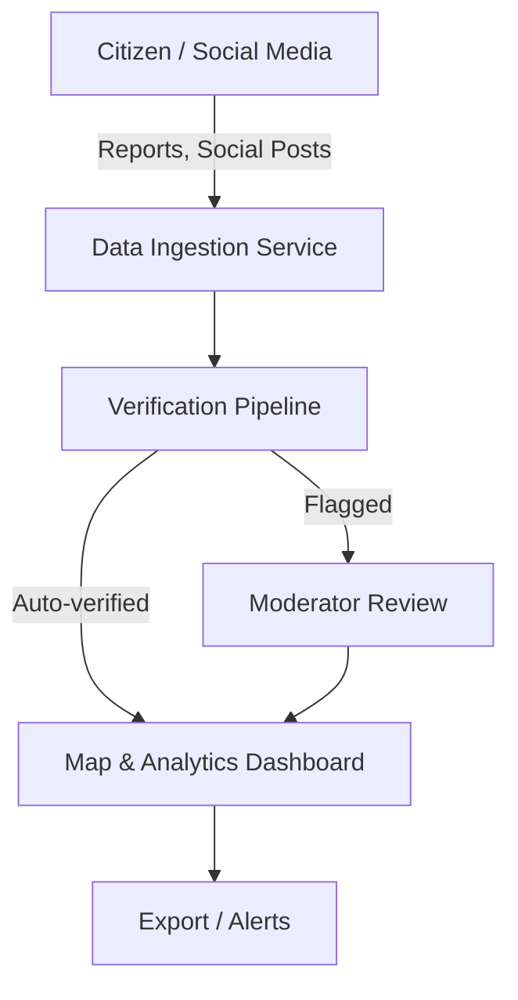
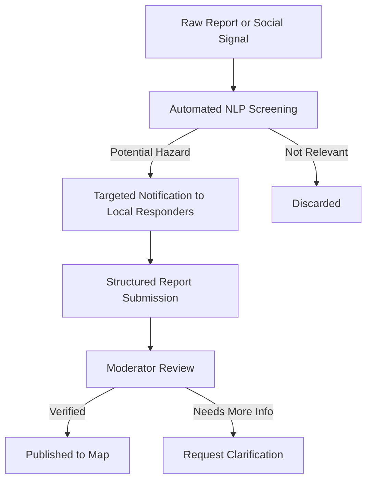

# The Chola Citadel

[](https://www.w3.org/WAI/standards-guidelines/wcag/) 
[](https://www.meity.gov.in/content/guidelines-government-websites) 
[](#localization)
[](LICENSE)

---

**The Chola Citadel** is a government-compliant, multi-lingual, ocean hazard and crisis reporting platform inspired by the world's pioneering civic technology solutions. Designed for reliability, trust, and accessibility, it empowers citizens, volunteers, scientists, and emergency responders to report, visualize, and analyze coastal threats and marine environmental crises in real time.

> *"Monitor ocean hazards, report environmental crises, and stay informed about coastal threats. Compliant with GIGW/WCAG 2.1 guidelines for accessibility."*

---

## Table of Contents
- [Background](#background)
- [Vision & Principles](#vision--principles)
- [Why Chola Citadel?](#why-chola-citadel)
- [Features](#features)
- [User Journeys](#user-journeys)
- [Architecture](#architecture)
    - [System Diagram (Mermaid)](#system-diagram-mermaid)
    - [Data Verification Flow (Mermaid)](#data-verification-flow-mermaid)
- [Accessibility & Compliance](#accessibility--compliance)
- [Localization](#localization)
- [Getting Started](#getting-started)
- [Contributing](#contributing)
- [Sustainability & Governance](#sustainability--governance)
- [References](#references)

---

## Background

Our oceans are under siege—rising temperatures, severe storms, pollution, and illegal activities threaten coastal communities and biodiversity alike, year after year. Old-school monitoring systems like satellites and buoys, while invaluable, often leave critical gaps: they're too slow, too sparse, or just not local enough. Meanwhile, the world's citizens are already out there, phones in hand, witnessing crises as they unfold.

But here's the rub: the real challenge isn't just gathering data—it's making sense of it, verifying it, and getting the right information into the hands of those who need it most.

Chola Citadel bridges that gap, inspired by the lessons of crisis-mapping giants and built for today's climate realities.

---

## Vision & Principles

**Vision:**  
To provide the most reliable, actionable, and community-driven real-time view of ocean and coastal health.

**Mission:**  
Empower everyone—from coastal scientists to local volunteers—to report, verify, and analyze hazards, driving faster response and more resilient communities.

**Core Principles:**
- **Open & Accessible:** Open-source, transparent, and designed for ease of use by all ages and backgrounds.
- **Trustworthy:** Every report is subject to transparent, multi-layered verification—trust is non-negotiable.
- **Secure & Private:** Privacy-first, with strict data minimization and robust security from the start.
- **Resilient:** Offline-first mobile support; works even when infrastructure is compromised.
- **Action-Oriented:** Not just collecting data—turning it into insight and action.

---

## Why Chola Citadel?

- **Multi-channel Reporting:** Collect reports via web, mobile apps (offline-ready), SMS, email, and social media.
- **Hybrid Data Model:** Handles both structured citizen reports and unstructured social media signals for maximum coverage.
- **Verification Workflow:** Combines automated NLP, moderator review, and field verification to weed out noise and misinformation.
- **Accessibility at Its Core:** Fully compliant with WCAG 2.1 and GIGW standards.
- **Tri-lingual Interface:** English, Hindi, Tamil—switch instantly, no fuss.
- **Actionable Insights:** Visualize hazards on a dynamic map, generate analytics, and export verified data for research or response.

---

## Features

- **Map Visualization:** Interactive coastal hazard maps with clustering, heatmaps, and historical overlays.
- **Report Submission:** Simple, accessible forms—text, photos, GPS—customizable for hazard types.
- **Admin Dashboard:** Protected analytics area for moderators and officials.
- **Multi-language UI:** Seamless switching between supported languages.
- **Offline-First Mobile Apps:** Create and manage reports even without internet; syncs automatically when online.
- **Social Media Ingestion:** Automated monitoring and triage of relevant public social posts.
- **Data Export:** Download verified reports in standard formats (GeoJSON, CSV).
- **Accessibility:** All components keyboard navigable, ARIA-labeled, and color-contrast tested.

---

## User Journeys

**Dr. Aris Thorne (Marine Biologist):**  
- Filters verified "Harmful Algal Bloom" reports on the map for the past two years.
- Downloads GeoJSON data for his research.
- Receives email alerts for new verified reports in his study region.

**Maria Flores (Community Volunteer):**  
- Submits a report via the mobile app about plastic debris after a storm—snaps a photo, adds a location, and selects hazard type.
- Receives notification when her report is verified and mapped.

**Emergency Responder:**  
- Monitors incoming real-time social media signals for oil spills.
- Dispatches notifications to local responders for ground verification.
- Uses analytics dashboard to track incident trends and plan response.

---

## Architecture

### System Diagram (Mermaid)


### Data Verification Flow (Mermaid)


---

## Accessibility & Compliance

- **WCAG 2.1 AA:** Color contrast, keyboard navigation, screen-reader friendly.
- **GIGW:** Government of India web guidelines met—multi-language, responsive, robust error handling.
- Regular accessibility audits ensure everyone can participate, regardless of ability.

---

## Localization

Switch between English, Hindi, and Tamil with a single click. All major UI elements, forms, and notifications are fully translated and culturally adapted.

---

## Getting Started

1. **Clone the repository:**
   ```sh
   git clone https://github.com/srujaniyengar/the-chola-citadel.git
   cd the-chola-citadel
   ```

2. **Install dependencies:**
   ```sh
   npm install
   ```

3. **Start the app:**
   ```sh
   npm run dev
   ```

4. **Login & Explore:**
   - Use the navigation menu to create reports, view the map, or access the protected analytics dashboard.
   - No backend required—everything's mocked for smooth MVP experience.

---

## Contributing

Pull requests are welcome! Whether you're a developer, accessibility advocate, or simply passionate about ocean health, contributions and feedback are encouraged. Please see [CONTRIBUTING.md](CONTRIBUTING.md) for details.

---

## Sustainability & Governance

Chola Citadel is built with long-term sustainability in mind—a hybrid funding approach that blends public infrastructure support, premium services for agencies, and research partnerships with universities and NGOs. The project is open-source and intended as digital public infrastructure, not just a tech demo.

---

## References

- Ushahidi Case Studies: https://www.ushahidi.com/in-action/case-studies  
- PetaJakarta.org White Paper: https://documents.uow.edu.au/content/groups/public/@web/@smart/documents/doc/uow200106.pdf  
- Social Media Analytics in Disaster Response: https://arxiv.org/pdf/2307.04046  
- Accessibility: https://www.w3.org/WAI/standards-guidelines/wcag/  
- GIGW Guidelines: https://www.meity.gov.in/content/guidelines-government-websites  
- Data Minimization: https://watech.wa.gov/data-minimization  
- Offline-First Mobile Development: https://medium.com/front-end-weekly/offline-first-ai-in-react-native-build-smarter-cloud-free-apps-in-2025-ad9c500d39df  
- [Additional references in source comments]

---

*“The Chola Citadel isn’t just a project; it’s a community-driven movement to make our coasts safer and smarter, together.”*
